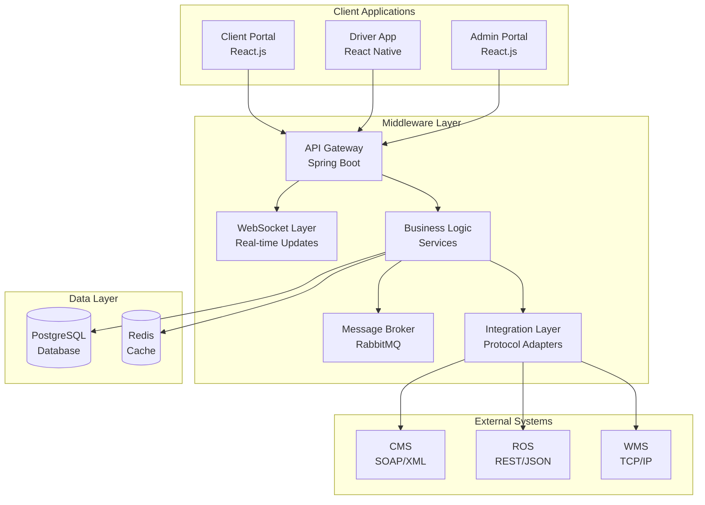

# SwiftLogistics Middleware Architecture

[]()
[]()
[]()
[]()
[]()

## 🚀 Project Overview

SwiftLogistics is a comprehensive middleware architecture solution designed to integrate heterogeneous systems for a rapidly growing logistics company in Sri Lanka. The system seamlessly connects three critical business systems while providing real-time tracking, high-volume order processing, and scalable delivery management.

### 🏗️ Systems Integration

- **CMS (Client Management System)**: Legacy SOAP/XML system for client contracts and billing
- **ROS (Route Optimization System)**: Modern REST/JSON cloud service for delivery route planning  
- **WMS (Warehouse Management System)**: Proprietary TCP/IP messaging system for package tracking

### 🎯 Key Business Objectives

1. **Seamless Integration**: Bridge protocol gaps between SOAP, REST, and TCP/IP systems
2. **Real-time Operations**: Live order tracking and instant notifications
3. **High-Volume Processing**: Handle peak loads during promotional events
4. **Transaction Consistency**: Ensure reliable distributed transaction management
5. **Scalable Architecture**: Support business growth and expansion
6. **Security First**: Implement comprehensive security across all communications

## 🏛️ Architecture Overview



## 🛠️ Technology Stack

### Backend Services
- **Framework**: Spring Boot 3.2.0
- **Language**: Java 17
- **Database**: PostgreSQL 15
- **Message Broker**: RabbitMQ 3.12
- **Cache**: Redis 7
- **Security**: Spring Security + JWT
- **WebSocket**: STOMP over SockJS

### Frontend Applications
- **Client Portal**: React.js 18 + Bootstrap 5
- **Driver App**: React Native 0.72
- **State Management**: React Hooks + Context API
- **Real-time**: SockJS + STOMP Client

### Infrastructure & DevOps
- **Containerization**: Docker + Docker Compose
- **Reverse Proxy**: Nginx
- **Monitoring**: Prometheus + Grafana
- **Build Tool**: Maven 3.9
- **Version Control**: Git

## 📁 Project Structure

```
SwiftLogistics/
├── 📁 backend/                 # Spring Boot middleware services
│   ├── 📁 src/main/java/com/swiftlogistics/middleware/
│   │   ├── 📁 config/          # Configuration classes
│   │   ├── 📁 controller/      # REST API controllers
│   │   ├── 📁 dto/             # Data transfer objects
│   │   ├── 📁 integration/     # External system adapters
│   │   ├── 📁 model/           # Domain entities
│   │   ├── 📁 repository/      # Data access layer
│   │   └── 📁 service/         # Business logic services
│   └── 📄 pom.xml
├── 📁 client-portal/           # React client application
│   ├── 📁 public/              # Static assets
│   ├── 📁 src/
│   │   ├── 📁 components/      # React components
│   │   ├── 📄 App.js          # Main application
│   │   └── 📄 index.js        # Entry point
│   └── 📄 package.json
├── 📁 driver-app/              # React Native mobile app
├── 📁 docs/                    # Documentation
│   ├── 📄 Architecture-Documentation.md
│   └── 📄 Setup-Guide.md
├── 📁 docker/                  # Containerization
│   ├── 📄 docker-compose.yml
│   └── 📁 mock-services/       # Mock external systems
└── 📄 README.md
```

## 🚀 Quick Start

### Option 1: Docker Compose (Recommended)

```bash
# Clone the repository
git clone <repository-url>
cd MiddleWare

# Start all services with Docker
cd docker
docker-compose up -d

# Verify all services are running
docker-compose ps
```

**Access Points:**
- 🌐 Client Portal: http://localhost:3000
- 🔧 Backend API: http://localhost:8080/api
- 🐰 RabbitMQ Management: http://localhost:15672 (guest/guest)

### Option 2: Manual Development Setup

```bash
# 1. Start Infrastructure
docker run -d --name postgres -e POSTGRES_DB=swiftlogistics -p 5432:5432 postgres:15
docker run -d --name rabbitmq -p 5672:5672 -p 15672:15672 rabbitmq:3.12-management

# 2. Start Backend
cd backend
./mvnw spring-boot:run

# 3. Start Frontend (new terminal)
cd client-portal
npm install && npm start
```

## 🔧 Key Features

### 📊 Client Portal
- **Order Management**: Create, track, and manage delivery orders
- **Real-time Tracking**: Live updates on order status and location
- **Dashboard Analytics**: Order statistics and delivery insights
- **Responsive Design**: Works on desktop, tablet, and mobile

### 📱 Driver Mobile App
- **Route Management**: View optimized delivery routes
- **Package Tracking**: Mark deliveries as completed or failed
- **Real-time Updates**: Receive instant route changes and priority deliveries
- **Proof of Delivery**: Digital signatures and photo capture

### ⚙️ Middleware Services
- **Protocol Translation**: SOAP ↔ REST ↔ TCP/IP conversion
- **Asynchronous Processing**: High-volume order queue management
- **Transaction Management**: Distributed transaction consistency
- **Real-time Notifications**: WebSocket-based live updates

## 🔒 Security Features

- **Authentication**: JWT-based stateless authentication
- **Authorization**: Role-based access control (Client, Driver, Admin)
- **Encryption**: TLS/HTTPS for all communications
- **API Security**: Rate limiting, input validation, CORS protection
- **Data Protection**: Encrypted storage and PII anonymization

## 📊 Performance & Scalability

- **Asynchronous Processing**: Non-blocking order processing pipeline
- **Message Queuing**: RabbitMQ for reliable message delivery
- **Caching**: Redis for high-performance data access
- **Database Optimization**: Connection pooling and query optimization
- **Horizontal Scaling**: Stateless services for easy scaling

## 🔗 API Documentation

### Core Endpoints

#### Orders API
```
POST   /api/orders              # Create new order
GET    /api/orders/{id}         # Get order details
GET    /api/orders/client/{id}  # Get client orders
GET    /api/orders/tracking/{number} # Track order
PUT    /api/orders/{id}/status  # Update order status
```

#### Real-time WebSocket
```
WS     /ws                      # WebSocket connection
SUB    /topic/orders/{id}       # Order status updates
SUB    /topic/notifications/{id} # User notifications
```

## 🧪 Testing

### Running Tests
```bash
# Backend unit tests
cd backend && ./mvnw test

# Frontend component tests
cd client-portal && npm test

# Integration tests
docker-compose -f docker-compose.test.yml up --abort-on-container-exit
```

### Test Coverage
- ✅ Unit Tests: Service layer business logic
- ✅ Integration Tests: External system adapters
- ✅ End-to-End Tests: Complete order flow
- ✅ Performance Tests: Load and stress testing

## 📈 Monitoring & Observability

- **Application Metrics**: Custom business metrics and KPIs
- **System Health**: Database connections, message queue status
- **Performance Monitoring**: Response times and throughput
- **Error Tracking**: Centralized error logging and alerting

## 🔧 Development

### Prerequisites
- ☕ Java 17+
- 🟢 Node.js 18+
- 🐳 Docker & Docker Compose
- 🗃️ PostgreSQL 15+
- 🐰 RabbitMQ 3.12+

### Setting Up Development Environment

1. **Clone Repository**
   ```bash
   git clone <repository-url>
   cd MiddleWare
   ```

2. **Environment Configuration**
   ```bash
   # Backend configuration
   cp backend/src/main/resources/application.properties.example backend/src/main/resources/application.properties
   
   # Frontend configuration  
   cp client-portal/.env.example client-portal/.env
   ```

3. **Start Development Services**
   ```bash
   # Infrastructure
   docker-compose up postgres rabbitmq redis -d
   
   # Backend
   cd backend && ./mvnw spring-boot:run
   
   # Frontend
   cd client-portal && npm start
   ```

### Code Standards
- **Java**: Google Java Style Guide
- **JavaScript**: ESLint + Prettier configuration
- **Git**: Conventional Commits specification
- **Documentation**: Markdown with mermaid diagrams

## 📚 Documentation

- 📖 [Architecture Documentation](docs/Architecture-Documentation.md) - Detailed system design
- 🛠️ [Setup Guide](docs/Setup-Guide.md) - Development environment setup
- 🔌 [API Reference](docs/API-Reference.md) - Complete API documentation
- 🏗️ [Deployment Guide](docs/Deployment-Guide.md) - Production deployment

## 🤝 Contributing

1. **Fork the Repository**
2. **Create Feature Branch**: `git checkout -b feature/amazing-feature`
3. **Commit Changes**: `git commit -m 'feat: add amazing feature'`
4. **Push to Branch**: `git push origin feature/amazing-feature`
5. **Open Pull Request**

## 🎓 Academic Context

**Course**: IS3108/SCS3203 - Middleware Architecture  
**Institution**: University of Colombo School of Computing  
**Assignment**: Middleware Architecture for Business Integration  
**Semester**: 2025 Semester 1

### Learning Objectives Achieved
- ✅ Design and implement middleware architectures
- ✅ Integrate heterogeneous systems with different protocols
- ✅ Implement asynchronous messaging patterns
- ✅ Apply enterprise integration patterns
- ✅ Ensure transaction consistency in distributed systems
- ✅ Implement real-time communication systems

## 📄 License

This project is licensed under the MIT License - see the [LICENSE](LICENSE) file for details.

## 🙏 Acknowledgments

- **Course Instructor**: For guidance on middleware architecture principles
- **Open Source Community**: For the excellent tools and frameworks
- **Team Members**: For collaborative development and testing

---

**Built with ❤️ by the SwiftLogistics Development Team**

*For support or questions, please refer to the documentation or create an issue.*
# middleware-SwiftLogistics

